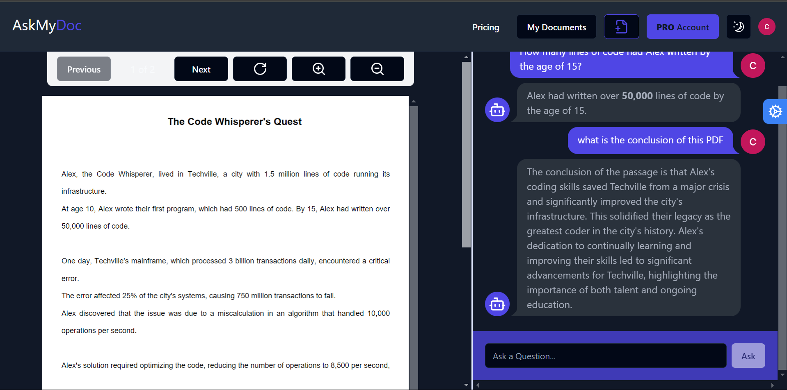
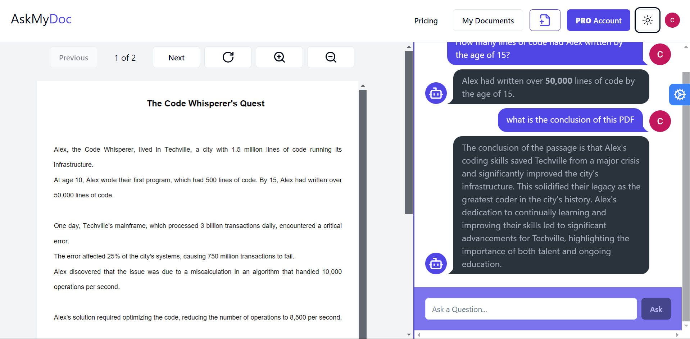

# AskMyDoc: Gen-AI-Powered PDF Assistant

[](https://nextjs.org/)  
[](https://langchain.com/)

**AskMyDoc** is an intelligent, Gen-AI-powered PDF assistant that helps users interact with their documents by uploading PDFs and asking contextual questions. The app utilizes cutting-edge Large Language Models (LLMs) from OpenAI and Gemini, with Pinecone as a vector database, to deliver fast, accurate answers. It also offers a premium plan for extended functionality via Stripe payments.

## 🚀 Features

- **AI-Powered PDF Assistant**: Chat with your PDFs using AI to extract information and get answers to your queries.
- **Dual LLM Support**: Integrates OpenAI and Google’s Gemini API for enhanced conversational capabilities.
- **Vector Database**: Uses Pinecone for high-speed, scalable, and efficient document searching and indexing.
- **Pro Plan**: Stripe-based payment integration for users who want to upgrade for advanced features.
- **Secure Authentication**: Firebase and ClerkApi for user authentication with multi-factor authentication (OTP).
- **Responsive UI**: Modern, responsive design built with Next.js, Tailwind, and daisyUI for seamless user experience.
  
## 🛠️ Technologies Used

- **Frontend**: [Next.js](https://nextjs.org/), [Tailwind CSS](https://tailwindcss.com/), [daisyUI](https://daisyui.com/)
- **Backend**: [Node.js](https://nodejs.org/), [Firebase](https://firebase.google.com/), [ClerkApi](https://clerk.dev/)
- **AI Integration**: [OpenAI API](https://openai.com/), [Gemini API](https://ai.google.com/gemini), [LangChain](https://langchain.com/)
- **Database**: [Pinecone](https://www.pinecone.io/)
- **Payments**: [Stripe](https://stripe.com/)
- **Version Control**: [Git](https://git-scm.com/)
- **Deployment**: Vercel (for hosting)

## 📸 Screenshots




## 📝 Getting Started

Follow the instructions below to get a copy of the project up and running on your local machine for development and testing.


### Installation

**Clone the repository**:
   ```bash
   git clone https://github.com/yourusername/askmydoc.git
   cd askmydoc
   ```

## 💡 How It Works

1. **User uploads a PDF**: Users can upload their PDF documents to the application.
2. **AI Query Processing**: The system uses LangChain with OpenAI and Gemini APIs to extract information from the PDF, split it into chunks, and create vector embeddings with Pinecone.
3. **Answer Questions**: Users can ask questions, and the AI will provide accurate, document-specific answers using the indexed PDF data.
4. **Pro Plan**: Users can upgrade to the Pro plan through Stripe to enjoy enhanced features such as processing larger files and priority support.

## ⚙️ Future Improvements

- **Multilingual Support**: Support for more languages beyond English.
- **More File Types**: Extend beyond PDFs to support Word, Excel, and PowerPoint.
- **Mobile App**: Build a companion mobile app for iOS and Android.

## 🧑‍💻 Author

- **Dharya Jasuja**  
